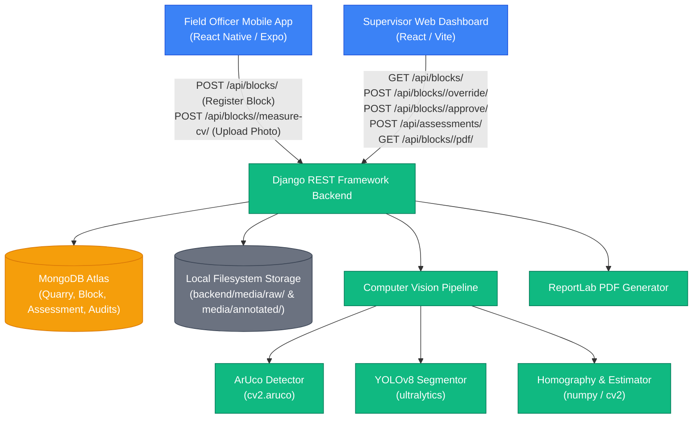

# Granite Block Measurement & Seigniorage Assessment POC
## Project Master Document & Complete Technical Audit

* **Audit Date:** August 31, 2026
* **Workspace Path:** `c:\granite-blocks`
* **Status:** Proof of Concept (POC) — Not Production-Ready

---

## 1. EXECUTIVE SUMMARY

### The Problem
In the granite mining industry, particularly in Andhra Pradesh, calculating government seigniorage fees (royalties) is traditionally a manual, slow, and error-prone process. Mining officers physically measure granite blocks at quarry sites using tape measures, manually calculate volumes, estimate weights, determine classifications, and log records. This manual flow is susceptible to:
* **Human errors** in tape-measure recording and hand-written data entry.
* **Under-reporting/revenue leakage** due to subjective approximation of block dimensions.
* **Lack of audit trails** and visual verification for fee calculations.

### Automated Granite Block Measurement
To address this, the proposed system introduces digital block registry tracking. By automating measurements, the state government aims to:
1. Ensure **uniform, objective measurements** via computer vision geometry.
2. Eliminate **manual measurement delays** and human clerical errors.
3. Establish a **complete, transparent audit trail** with photographic evidence, GPS markers, and supervisor sign-offs.

### The Proposed System vs. What Has Been Built
The proposed target system consists of a mobile app for quarry field officers to capture block images and GPS details, a backend sizing and assessment service, and a web dashboard for supervisors to approve inspection sheets.

What has **actually been built** in this Proof of Concept (POC) includes:
* **A Django REST backend** that registers blocks, receives image uploads, runs a computer vision sizing pipeline, stores metadata in MongoDB Atlas, and exports ReportLab PDF inspection reports.
* **A Computer Vision pipeline** using ArUco markers for scale and orientation, and a pre-trained YOLOv8-seg model for block shape boundary isolation.
* **A React Native Expo mobile application** that captures block IDs, queries GPS locations, integrates with the native camera/gallery, provides previews, and uploads files.
* **A React + Vite Web Dashboard** allowing supervisors to view block registries, manually override measurements, perform audits, execute seigniorage lookups, and approve or reject blocks.

### Current POC Limitations
The system is currently in a **Proof of Concept (POC) state** and is **not production-grade**. Its key limitations are:
* **YOLOv8 Segmentation limitation:** Sizing uses the generic `yolov8n-seg.pt` model (trained on the COCO dataset). This model does not detect or segment granite blocks. It only works on simulated synthetic shapes.
* **Security & Authentication:** The API is completely public, lacking token authentication or authorization controls.
* **No official system integrations:** Weighbridge matching, dispatch reconciliation, and OMEPS 2.0 government portals are planned but not implemented.

---

## 2. ORIGINAL GOVERNMENT USE CASE REQUIREMENTS

Below is a breakdown of the requirements for the **AP RTGS AI Hackathon use case: "AI-Based Granite Block Measurement and Automated Seigniorage Assessment"**, showing what has been built versus what is pending:

| Requirement | Hackathon Description | Current Implementation Status | Inspected Location |
| :--- | :--- | :--- | :--- |
| **L/B/H Measurement** | Compute length, breadth, and height in meters. | **IMPLEMENTED — NOT FULLY VALIDATED** | [`estimator.py`](file:///c:/granite-blocks/cv_pipeline/estimator.py) |
| **Volume Calculation** | Compute block volume deterministically ($L \times B \times H$). | **IMPLEMENTED — NOT FULLY VALIDATED** | [`calculations.py`](file:///c:/granite-blocks/backend/blocks/calculations.py#L1-L25) |
| **GPS-Tagged Capture** | Record inspector GPS coordinate pairs. | **IMPLEMENTED — NOT FULLY VALIDATED** | [`App.js`](file:///c:/granite-blocks/field-officer-app/App.js#L102-L119) |
| **Timestamped Records** | Clock inspection inputs and processing times. | **IMPLEMENTED — NOT FULLY VALIDATED** | [`models.py`](file:///c:/granite-blocks/backend/blocks/models.py#L46) |
| **Automated Seigniorage** | Lookup rates and compute royalties. | **IMPLEMENTED — NOT FULLY VALIDATED** | [`services.py`](file:///c:/granite-blocks/backend/blocks/services.py#L34-L80) |
| **Weighbridge Validation** | Cross-reference measurements with weighbridges. | **PLANNED / NOT IMPLEMENTED** | N/A (Field placeholders only) |
| **Dispatch Validation** | Reconcile records with dispatch weigh bills. | **PLANNED / NOT IMPLEMENTED** | N/A (Field placeholders only) |
| **Supervisor Dashboard** | Console for overrides and approvals. | **IMPLEMENTED — NOT FULLY VALIDATED** | [`App.jsx`](file:///c:/granite-blocks/supervisor-dashboard/src/App.jsx) |
| **PDF Report Export** | Generate official signed inspection PDFs. | **IMPLEMENTED — NOT FULLY VALIDATED** | [`pdf_generator.py`](file:///c:/granite-blocks/backend/blocks/pdf_generator.py) |
| **Traceability/Audit Log** | Log every change and supervisor override. | **IMPLEMENTED — NOT FULLY VALIDATED** | [`views.py`](file:///c:/granite-blocks/backend/blocks/views.py#L465-L529) |
| **Multi-Quarry Scale** | Support multiple quarry registers. | **PARTIALLY IMPLEMENTED** | [`models.py`](file:///c:/granite-blocks/backend/blocks/models.py#L4-L16) (Supports multiple Quarry documents, but lacks multi-tenant access controls) |
| **OMEPS 2.0 Integration**| Connect directly to government mining portals. | **PLANNED / NOT IMPLEMENTED** | N/A |
| **API/Data Security** | Secure access and encrypted communication. | **PLANNED / NOT IMPLEMENTED** | N/A |

---

## 3. COMPLETE PROJECT ARCHITECTURE

The overall logical architecture of the POC system is shown below:



### Components and Communication Path
* **Field Officer App:** Collects GPS coordinates and images, and sends them to the backend using multipart form-data.
* **Supervisor Web Dashboard:** Retrieves block entries, processes overrides and approvals, and triggers seigniorage calculations.
* **Django REST Backend:** Authenticates incoming requests (mocked), coordinates image uploads, invokes the CV sizing pipeline, manages data persistence, and renders PDF reports.
* **Computer Vision Pipeline:** Runs inside the Django thread during image upload. It detects ArUco markers, segments the block, maps homographies, estimates dimensions ($L/B/H$), and exports annotated images.
* **MongoDB Atlas:** Serves as the primary database, storing metadata for quarries, blocks, assessments, and audit logs.
* **Media Directory:** Stores physical raw and annotated images locally on the server filesystem.

---

## 4. PROJECT DIRECTORY STRUCTURE

Inspecting `c:\granite-blocks\`:

### 1. `backend/`
* **Purpose:** Handles the Django application server.
* **Important Files:**
  * [`backend/settings.py`](file:///c:/granite-blocks/backend/backend/settings.py): Connection configuration for MongoDB Atlas.
  * [`blocks/models.py`](file:///c:/granite-blocks/backend/blocks/models.py): Schema definitions for Quarry, Block, Assessment, and AuditLog.
  * [`blocks/views.py`](file:///c:/granite-blocks/backend/blocks/views.py): REST controllers for overrides, approvals, image uploads, and assessments.
  * [`blocks/calculations.py`](file:///c:/granite-blocks/backend/blocks/calculations.py): Volume and weight math formulas.
  * [`blocks/services.py`](file:///c:/granite-blocks/backend/blocks/services.py): Seigniorage billing and assessment workflows.
  * [`blocks/pdf_generator.py`](file:///c:/granite-blocks/backend/blocks/pdf_generator.py): ReportLab PDF builder.
* **Technology:** Python, Django, DRF, MongoEngine, ReportLab.

### 2. `cv_pipeline/`
* **Purpose:** Processes block measurements from images.
* **Important Files:**
  * [`pipeline.py`](file:///c:/granite-blocks/cv_pipeline/pipeline.py): The main pipeline class that orchestrates processing.
  * [`detector.py`](file:///c:/granite-blocks/cv_pipeline/detector.py): ArUco marker detection and pose estimation.
  * [`segmentor.py`](file:///c:/granite-blocks/cv_pipeline/segmentor.py): YOLOv8-based block boundary extraction.
  * [`estimator.py`](file:///c:/granite-blocks/cv_pipeline/estimator.py): Homography projections and dimension estimation.
  * [`test_pipeline.py`](file:///c:/granite-blocks/cv_pipeline/test_pipeline.py): Test script that generates synthetic images to verify homography.
* **Technology:** OpenCV, NumPy, Ultralytics YOLOv8.

### 3. `field-officer-app/`
* **Purpose:** Mobile client application for field inspectors.
* **Important Files:**
  * [`App.js`](file:///c:/granite-blocks/field-officer-app/App.js): Application entrypoint, routing logic, and core UI views.
  * [`src/services/api.js`](file:///c:/granite-blocks/field-officer-app/src/services/api.js): Network service wrapper for backend endpoints.
* **Technology:** React Native, Expo, AsyncStorage.

### 4. `supervisor-dashboard/` (and duplicate `frontend/`)
* **Purpose:** Web portal for supervisors to review and approve measurements.
* **Important Files:**
  * [`src/App.jsx`](file:///c:/granite-blocks/supervisor-dashboard/src/App.jsx): Layout and view controllers for the dashboard.
  * [`src/services/api.js`](file:///c:/granite-blocks/supervisor-dashboard/src/services/api.js): Network wrapper for dashboard queries.
  * [`vite.config.js`](file:///c:/granite-blocks/supervisor-dashboard/vite.config.js): Proxy rules routing `/api` and `/media` to localhost:8000.
* **Technology:** React, Vite.

### 5. `Test-images/`
* **Purpose:** Stores test photographs and assets (e.g., state government logos and banners) for the user interfaces.

---

## 5. TECHNOLOGY STACK

This table lists the technologies and versions used in the project:

| Technology | Discovered Version | Purpose | Implemented Location |
| :--- | :--- | :--- | :--- |
| **Python** | `3.13.15` | Runtime engine for backend and CV pipeline. | `backend/`, `cv_pipeline/` |
| **Django** | `6.1` | Core backend framework. | [`backend/backend/settings.py`](file:///c:/granite-blocks/backend/backend/settings.py) |
| **Django REST Framework** | `3.18.0` | API serialization and routing views. | [`backend/blocks/serializers.py`](file:///c:/granite-blocks/backend/blocks/serializers.py) |
| **MongoEngine** | `0.29.3` | Object-Document Mapper (ODM) for MongoDB. | [`backend/blocks/models.py`](file:///c:/granite-blocks/backend/blocks/models.py) |
| **MongoDB Atlas** | Hosted Atlas cluster | Cloud database storage. | Conf. in [`backend/.env`](file:///c:/granite-blocks/backend/.env) |
| **OpenCV** | `5.0.0` | Image processing and matrix transformations. | [`cv_pipeline/detector.py`](file:///c:/granite-blocks/cv_pipeline/detector.py) |
| **ArUco** | DICT_5X5_50 (OpenCV) | Reference markers used to scale measurements. | [`cv_pipeline/detector.py`](file:///c:/granite-blocks/cv_pipeline/detector.py) |
| **YOLOv8** | Ultralytics `8.4.131` | Installs YOLO segmenter models. | [`cv_pipeline/segmentor.py`](file:///c:/granite-blocks/cv_pipeline/segmentor.py) |
| **NumPy** | `2.5.1` | Matrix and perspective calculations. | [`cv_pipeline/estimator.py`](file:///c:/granite-blocks/cv_pipeline/estimator.py) |
| **ReportLab** | `5.0.0` | Generates inspection report PDFs. | [`backend/blocks/pdf_generator.py`](file:///c:/granite-blocks/backend/blocks/pdf_generator.py) |
| **React** | `^19.2.8` | UI rendering for the Supervisor Dashboard. | `supervisor-dashboard/` |
| **Vite** | `^8.2.2` | Dev server and bundler for the dashboard. | `supervisor-dashboard/` |
| **React Native** | `0.81.5` | Mobile framework for the Field Officer app. | `field-officer-app/` |
| **Expo** | `~54.0.8` | Development suite for the mobile app. | `field-officer-app/package.json` |

---

## 6. AI / ML / COMPUTER VISION MODELS

### Custom Model Statement
> [!IMPORTANT]
> **No custom AI/ML model has been trained in the current POC.**

### Model Inventory

#### 1. Pre-trained YOLOv8 segmentation
* **Model Name:** YOLOv8n-seg
* **File Name:** `yolov8n-seg.pt`
* **File Path:** `c:\granite-blocks\yolov8n-seg.pt`
* **Framework:** Ultralytics YOLOv8 PyTorch
* **Purpose:** Segments shape contours to define block boundaries.
* **Input:** BGR image array.
* **Output:** Pixel coordinates of bounding box masks.
* **Pretrained/Custom:** Pre-trained (COCO Dataset).
* **Trained by us?** No.
* **Used at runtime?** Yes. However, because it is trained on the COCO dataset, it does not segment granite blocks. It only detects COCO objects (e.g., persons, bags).

#### 2. ArUco Marker Detection
* **Model Name:** ArUco Marker Classifier
* **Framework:** OpenCV (algorithmic CV)
* **Purpose:** Locates physical marker corners on the block to scale pixel measurements.
* **Input:** Grayscale image array.
* **Output:** 2D coordinate lists of detected marker corners.
* **Trained by us?** No.
* **Used at runtime?** Yes (requires ID 1 on the front face and ID 2 on the side face).
* **Is it AI?** **NO**. This is algorithmic computer vision based on thresholding and contour extraction, not a machine learning model.

#### 3. Plane-to-Plane Homography
* **Model Name:** Perspective Homography Transform
* **Framework:** NumPy / OpenCV
* **Purpose:** Project raw pixel contours onto a physical plane using the known size of the ArUco markers ($20\text{ cm}$).
* **Input:** 2D pixel coordinates and marker corners.
* **Output:** Scaled physical coordinates (in centimeters).
* **Trained by us?** No.
* **Used at runtime?** Yes.
* **Is it AI?** **NO**. This is traditional perspective geometry.

---

## 7. CURRENT COMPUTER VISION PIPELINE

This diagram traces the execution flow when a field officer uploads a photo:

```
[Uploaded Image]
       │
       ▼
[MarkerDetector.detect] (detector.py)
       │  Inputs: Raw BGR image
       │  Processing: Grayscales image and runs cv2.aruco.detectMarkers()
       │  Outputs: Corner coordinates, IDs, translation vectors, and pixel scales
       │  Error check: Returns an empty list if no markers are detected
       ▼
[BlockSegmentor.segment] (segmentor.py)
       │  Inputs: Raw BGR image, ArUco center coordinates
       │  Processing: Runs yolov8n-seg.pt, resizes masks, and filters by marker proximity
       │  Outputs: Binary mask (values 0 or 255)
       │  Error check: Returns None if no segmentations match
       ▼
[VolumeEstimator.estimate] (estimator.py)
       │  Inputs: Binary mask, detected markers list, density value
       │  Processing:
       │    1. Extracts block contour from mask
       │    2. Computes homography projection for primary marker (ID 1)
       │    3. Transforms contour to estimate Length and Height
       │    4. Computes homography projection for side marker (ID 2)
       │    5. Transforms contour to estimate Breadth (Depth)
       │    6. Calculates Volume (L * B * H) and Weight (Volume * Density)
       │  Outputs: JSON metrics dictionary (length_m, breadth_m, height_m, volume_m3, etc.)
       │  Error check: Returns status: 'error' if ID 1 or ID 2 is missing
       ▼
[Orchestrator pipeline.py]
          Calculates stats overlays and writes annotated output image to disk
```

---

## 8. "WHAT HAPPENS WHEN THE OFFICER CLICKS CAPTURE?"

Step-by-step mobile capture and upload workflow:

1. **Launch:** Field officer opens the app, enters the server URL, and authenticates (`App.js:19-94`).
2. **Quarry selection:** The officer selects the Quarry ID (`App.js:30`).
3. **Block entry:** The officer enters the Block ID (`App.js:31`).
4. **GPS Capture:** The officer clicks "Capture GPS Position". The app requests permissions and retrieves coordinates (`App.js:102-119` using `Location.getCurrentPositionAsync()`).
5. **Camera/Gallery Trigger:** The officer clicks "Capture Granite Photograph". The app presents native camera and gallery options (`App.js:512-521`).
6. **Image selection:**
   * **Camera:** Opens the camera, captures a photo, and returns a local URI (`App.js:122-156` using `ImagePicker.launchCameraAsync()`).
   * **Gallery:** Opens the gallery, allows photo selection, and returns a local URI (`App.js:158-192` using `ImagePicker.launchImageLibraryAsync()`).
7. **Preview:** Displays the photo preview, allowing the officer to retake or change the image (`App.js:499-523`).
8. **Register Block:** The officer clicks "Analyze Block". The app registers the block details via `POST /api/blocks/` (`App.js:195-219` using `apiService.createBlock()`).
9. **Upload & Measure:** The app uploads the image as multipart data (`api.js:46-73`) via `POST /api/blocks/<id>/measure-cv/`.
10. **Backend Processing:**
    * Django receives the file and saves it to `backend/media/raw/` (`views.py:342-377`).
    * Instantiates `GraniteCVPipeline(model_path="yolov8n-seg.pt")` (`views.py:379-383`).
    * Runs CV analysis, saves the annotated image to `backend/media/annotated/`, and updates the database (`views.py:384-450`).
11. **Display Results:** The app displays the returned measurements ($L/B/H/\text{Volume}$), the annotated image, and the confidence score (`App.js:547-594`).
12. **Submit:** The officer submits the inspection, which saves the record locally and returns to the home screen (`App.js:279-301`).

---

## 9. CAMERA AND IMAGE CAPTURE IMPLEMENTATION

* **Expo Integration:** Uses `expo-image-picker` (~17.0.11) to access the device's camera and photo library, and `expo-location` (~19.0.8) for GPS coordinates.
* **Permissions:** Triggers permission prompts dynamically. Handles denials by showing alert banners.
* **Cancellation:** Handles camera/gallery cancellations gracefully by returning early if `result.canceled` is true.
* **Binary File Upload:** Converts the local file URI to a multipart payload under the `'image'` field key in `FormData`.
* **Image Storage Lifecycle:**
  1. Stored temporarily on the mobile device's local cache.
  2. Transmitted via HTTP multipart request to the Django server.
  3. Django saves the raw file to `backend/media/raw/`.
  4. The pipeline processes the image and saves the annotated copy to `backend/media/annotated/`.
  5. MongoDB Atlas stores relative path references. **The raw image binary is never saved in the database.**

---

## 10. IMAGE STORAGE ARCHITECTURE

All images are saved locally on the Django server filesystem:

* **MEDIA_ROOT:** Configuration points to `backend/media/` (`settings.py:165`).
* **MEDIA_URL:** Exposed URL path is `/media/` (`settings.py:164`).
* **Original Photos:** Saved as `backend/media/raw/{block_id}_{timestamp}_raw.png`.
* **Annotated Photos:** Saved as `backend/media/annotated/{block_id}_{timestamp}_annotated.png`.
* **Database Pointers:**
  * `raw_image_path`: Path relative to media root (e.g., `"raw/GR-001_20260831_100000_raw.png"`).
  * `annotated_image_path`: Path relative to media root (e.g., `"annotated/GR-001_20260831_100000_annotated.png"`).
  * `image_paths`: Array containing both paths.
* **Retrieval:** The dashboard fetches files via `/media/{path}` (proxied by Vite), and the PDF generator reads files directly from the disk using `settings.MEDIA_ROOT`.

---

## 11. DATABASE ARCHITECTURE

The system uses **MongoDB Atlas** for metadata storage, structured with the following relationship mappings:

```
  ┌───────────────────────┐          ┌───────────────────────┐
  │        Quarry         │◄─────────┤         Block         │
  │  ───────────────────  │          │  ───────────────────  │
  │  id (Primary Key)     │          │  block_id (Unique)    │
  │  name                 │          │  quarry (Ref)         │
  │  location             │          │  gps_latitude         │
  │  created_at           │          │  gps_longitude        │
  └───────────────────────┘          │  status               │
                                     │  measurement (Embed)  ├────────┐
                                     │  cv_status            │        │
                                     │  raw_image_path       │        │
  ┌───────────────────────┐          │  annotated_image_path │        │ Contains
  │      Assessment       │          │  approval_status      │        │ Snapshots
  │  ───────────────────  │          └───────────┬───────────┘        │ of
  │  block (Ref)          │◄─────────────────────┘                    │ Measurements
  │  granite_category     │                      │                    │
  │  classification       │                      ▼                    ▼
  │  weight_mt            │          ┌───────────────────────┐  ┌───────────────────────┐
  │  indicative_seigniorage│         │       AuditLog        │  │      Measurement      │
  │  density_mt_per_m3    │          │  ───────────────────  │  │  ───────────────────  │
  │  status               │          │  block (Ref)          │  │  length_m             │
  └───────────────────────┘          │  action               │  │  breadth_m            │
                                     │  actor                │  │  height_m            │
                                     │  details              │  │  volume_m3            │
                                     │  timestamp            │  │  confidence           │
                                     └───────────────────────┘  └───────────────────────┘
```

### Core Schema Collections

#### `quarries` Collection
Stores quarry site definitions. Primary key is the user-defined `id` string (e.g., `Q-9982`).

#### `blocks` Collection
Stores block metadata, statuses, and image paths. Contains an embedded `Measurement` sub-document for active dimensions, and an optional `original_measurement` sub-document to store pre-override CV values.

#### `assessments` Collection
Stores seigniorage calculations. References `Block` via a cascade-delete reference field.

#### `audit_logs` Collection
Stores transaction history logs, referencing the associated `Block`.

---

## 12. API ARCHITECTURE

Django REST endpoints defined in [`backend/blocks/urls.py`](file:///c:/granite-blocks/backend/blocks/urls.py):

| Method | Endpoint | Purpose | Request Body | Response Payload | Source View |
| :--- | :--- | :--- | :--- | :--- | :--- |
| **GET** | `/api/blocks/` | List all blocks. | None | JSON block array | `BlockListCreateAPIView` |
| **POST** | `/api/blocks/` | Register block details. | `{"block_id": "...", "quarry_id": "..."}` | JSON created block | `BlockListCreateAPIView` |
| **GET** | `/api/blocks/<id>/` | Fetch details of a block. | None | JSON block details | `BlockDetailAPIView` |
| **POST** | `/api/blocks/<id>/measure-cv/` | Run CV analysis on upload. | Multipart `image` file | JSON block details | `BlockMeasureCVAPIView` |
| **POST** | `/api/blocks/<id>/override/` | Override dimensions. | `{"length_m": ..., "reason": "..."}` | JSON block details | `BlockOverrideAPIView` |
| **POST** | `/api/blocks/<id>/approve/` | Approve/reject block. | `{"approval_status": "..."}` | JSON block details | `BlockApproveAPIView` |
| **GET** | `/api/blocks/<id>/pdf/` | Stream PDF report. | None | Streaming PDF bytes | `BlockPDFAPIView` |
| **GET** | `/api/blocks/<id>/audit-logs/` | Fetch edit logs. | None | JSON audit array | `BlockAuditLogsAPIView` |
| **POST** | `/api/assessments/` | Save seigniorage assessment. | `{"block_id": "...", "density": ...}` | JSON assessment record | `AssessmentListCreateAPIView` |
| **GET** | `/api/assessments/` | List all assessments. | None | JSON assessment list | `AssessmentListCreateAPIView` |
| **GET** | `/api/assessments/<id>/` | Fetch assessment details. | None | JSON assessment details | `AssessmentDetailAPIView` |

### API Mismatches & Observations
1. **Missing CORS Configuration:** Django lacks CORS headers, which requires Vite to proxy dashboard traffic.
2. **Hardcoded IP Address:** The mobile client references a hardcoded IP (`192.168.1.166:8000`) instead of utilizing environment variables.

---

## 13. FIELD OFFICER MOBILE APP

Implemented screens in the mobile application:

* **Authentication & Config (`App.js:338-378`):** Inspectors input their username, password, and the server IP address.
* **Home Panel (`App.js:394-449`):** Displays options to start a "NEW BLOCK INSPECTION", view recent inspection logs, and sync pending drafts.
* **New Inspection (`App.js:452-535`):** Inputs the Block ID, captures GPS coordinates, and triggers the device camera or gallery to select a photograph. Shows loading indicators during upload.
* **CV Result Screen (`App.js:547-594`):** Displays the calculated length, breadth, height, and volume, along with the annotated image overlay and verification confidence score.
* **Sync & History Screen (`App.js:597-634`):** Displays a history of submitted inspections and allows inspectors to review offline drafts stored in AsyncStorage.

---

## 14. SUPERVISOR DASHBOARD

Implemented features in the Supervisor Dashboard:

* **HUD Sizing Metrics (`App.jsx:224-249`):** Displays overview cards for total blocks, pending reviews, approved blocks, rejected blocks, CV failures, and overrides.
* **Sidebar Controls (`App.jsx:254-323`):** Search bar and filter selectors to filter records by status and quarry location.
* **Geometric Previews (`App.jsx:351-385`):** Displays active dimensions ($L/B/H/\text{Volume}$) and the CV confidence score.
* **Image Panel (`App.jsx:406-417`):** Side-by-side display of the raw quarry photograph and the annotated computer vision overlay.
* **Manual Override (`App.jsx:430-468`):** Form inputs allowing supervisors to enter override values (requires a reason justification and the supervisor's name).
* **Approval Actions (`App.jsx:420-427`):** Controls to approve dimensions or reject blocks (requires a rejection justification).
* **Assessment Panels (`App.jsx:470-534`):** Inputs to select the granite category and density, run seigniorage calculations, and download PDF reports.
* **Timeline Audit Logs (`App.jsx:537-551`):** Displays chronological logs of edits, approvals, and overrides.

---

## 15. MANUAL OVERRIDE AND AUDIT TRAIL

When a supervisor overrides block measurements:
1. **Preserve CV Data:** The original CV values are copied and saved to `Block.original_measurement`.
2. **Apply Overrides:** Updates `Block.measurement` with the manual values and sets `is_overridden = True`.
3. **Audit Log:** Saves an `AuditLog` entry detailing the changed dimensions, the supervisor's name, the reason justification, and a timestamp.
4. **Dashboard Warning:** Displays the override details on the dashboard with warning banners.

---

## 16. SEIGNIORAGE ASSESSMENT ENGINE

Calculations are configured in `calculations.py` and `services.py`:

* **Estimated Weight (MT):** Calculated as $\text{Volume} \times \text{Density}$.
* **Applicable Rate Lookup:** Looks up rates based on category and classification:
  * Premium Gangsaw: `3000.0` | Mini Gangsaw: `2500.0` | Scabos/Other: `2000.0`
  * Standard Gangsaw: `2200.0` | Mini Gangsaw: `1800.0` | Scabos/Other: `1400.0`
  * Commercial Gangsaw: `1500.0` | Mini Gangsaw: `1200.0` | Scabos/Other: `900.0`
  * Default Rate fallback: `1000.0`
* **Seigniorage Fee:** Calculated as $\text{Weight} \times \text{Rate}$.
* **disclaimer warning:** "POC ONLY: This calculation uses proof-of-concept placeholder rates and density values. Official government rates are not applied."

---

## 17. PDF REPORT GENERATION

The PDF report generation is implemented using **ReportLab** in [`pdf_generator.py`](file:///c:/granite-blocks/backend/blocks/pdf_generator.py):

* **Request Flow:**
  1. Web dashboard requests `/api/blocks/<id>/pdf/`.
  2. The endpoint fetches the block metadata and any associated assessment records.
  3. The ReportLab generator builds a PDF template containing the data tables and annotated image.
  4. The PDF file is streamed back to the browser for download.
* **PDF Elements:** Includes the block ID, quarry name, GPS coordinates, timestamp, active dimensions, original CV measurements (if overridden), seigniorage calculations, and the annotated image overlay.

---

## 18. CURRENT VALIDATION / TESTING

The project contains automated and manual test suites:

* **Automated CV Pipeline Tests:** [test_pipeline.py](file:///c:/granite-blocks/cv_pipeline/test_pipeline.py) verifies the CV pipeline by generating synthetic images with simulated blocks and ArUco markers. Status: **PASSING**.
* **Automated Django Unit Tests:** [tests.py](file:///c:/granite-blocks/backend/blocks/tests.py) runs 25 test cases for models and REST endpoints. Status: **FAILED (12 failures)**.
  * *Reason:* The test suite instantiates `Quarry` without the required `id` field, raising a validation error.
* **Manual Smoke Tests:**
  * `smoke_test.py`: Verifies block registry endpoints. Status: **PASSING**.
  * `smoke_test_assessments.py`: Verifies assessment calculations. Status: **PASSING**.
  * `smoke_test_cv.py`: Verifies image uploads. Status: **PASSING** (returns the expected 400 error due to YOLO segmentation limitations).

---

## 19. REAL-WORLD CV VALIDATION

The workspace includes sample test photographs under `Test-images/`:

* **`1.jpeg` & `2.jpeg`:** High-resolution photographs of granite blocks in a quarry.
* **CV Validation Outcome:**
  * **ArUco Marker Detection:** Fails because the physical test blocks do not have ArUco markers attached.
  * **YOLOv8 Segmentation:** Fails because the pre-trained COCO model cannot segment granite blocks.
  * **Homography:** Fails because it requires detected ArUco markers to compute perspective projections.
* **Validation Summary:** The CV pipeline works on simulated synthetic images with ArUco markers, but fails on real-world quarry photographs because it lacks a custom-trained segmentation model.

---

## 20. WHAT WE HAVE ACTUALLY BUILT

Summary of implemented features:

| Module / Requirement | Implemented? | Technology | Current Status |
| :--- | :--- | :--- | :--- |
| **Field Officer Mobile App** | **YES** | React Native, Expo | Functional client interface |
| **Supervisor Dashboard** | **YES** | React, Vite | Functional review panel |
| **Backend API Server** | **YES** | Django REST Framework | Active REST API endpoints |
| **MongoDB Database** | **YES** | MongoEngine, Atlas | Cloud storage for metadata |
| **ArUco Detection** | **YES** | OpenCV | Decodes reference marker scale |
| **YOLOv8 Segmentation** | **YES** | Ultralytics YOLOv8 | Pre-trained COCO model integrated |
| **Volume Calculation** | **YES** | Deterministic Python math | Computes $L \times B \times H$ |
| **Seigniorage Assessment** | **YES** | Deterministic Python math | Computes fees based on POC rates |
| **PDF Report Generation** | **YES** | ReportLab | Streamed PDF file generation |
| **Audit Trails** | **YES** | MongoEngine models | Tracks overrides and approvals |
| **GPS Coordinate Capture** | **YES** | Expo Location | Captures GPS coordinates |
| **Image Upload Pipeline** | **YES** | Multipart requests | Saves raw and annotated images |
| **Weighbridge validation** | **NO** | None | Planned/Not Implemented |
| **Dispatch reconciliation** | **NO** | None | Planned/Not Implemented |
| **OMEPS 2.0 Integration** | **NO** | None | Planned/Not Implemented |

---

## 21. WHAT WE HAVE NOT BUILT YET

The following features must be implemented before a production release:

### 1. AI/ML & Computer Vision
* **Custom Granite Segmentation Model:** Train a custom YOLOv8-seg model on a dataset of annotated granite blocks.
* **Camera Calibration:** Implement camera calibration routines to improve homography accuracy.
* **Environmental Sizing Checks:** Test the CV pipeline under difficult lighting conditions, wet granite, and occlusion.

### 2. Government Integration
* **OMEPS 2.0 Integration:** Connect directly to the AP state government portal to sync inspections and billing.
* **Weighbridge Validation:** Integrate with weighbridge scale APIs to cross-check calculated block weights.
* **Dispatch Validation:** Integrate with dispatch records to verify matching transport transit permits.

### 3. Security & Infrastructure
* **Access Control:** Implement user authentication (e.g., JWT) for mobile apps and web dashboards.
* **Cloud Storage:** Securely store raw and annotated images in cloud object storage (e.g., AWS S3) instead of local server directories.
* **Production Deployment:** Configure production server hosting with SSL/HTTPS certificates.

---

## 22. FUTURE AI / ML MODELS REQUIRED

Recommended model workflow for a production release:

```
                  ┌─────────────────────────────────────────┐
                  │          Raw Captured Photograph        │
                  └────────────────────┬────────────────────┘
                                       │
                                       ▼
                  ┌─────────────────────────────────────────┐
                  │     Image Quality Validation Model      │  ◄─── (RECOMMENDED: Detects blurry or
                  └────────────────────┬────────────────────┘         obstructed photos)
                                       │
                                       ▼
                  ┌─────────────────────────────────────────┐
                  │    YOLOv8 Custom Granite Segmentor      │  ◄─── (REQUIRED: Segments granite block
                  └────────────────────┬────────────────────┘         boundaries)
                                       │
                                       ▼
                  ┌─────────────────────────────────────────┐
                  │     Granite Classifier Model            │  ◄─── (OPTIONAL: Predicts commercial vs.
                  └─────────────────────────────────────────┘         premium granite categories)
```

1. **Custom YOLOv8 Granite Segmentor (REQUIRED):**
   * *Problem:* Pre-trained models cannot segment granite blocks.
   * *Required Dataset:* Thousands of annotated photographs of granite blocks in quarry environments.
2. **Image Quality Validation Model (RECOMMENDED):**
   * *Problem:* Blurry photos, low lighting, or obstructed markers cause homography errors.
   * *Purpose:* Validates photo quality before starting CV analysis.
3. **Granite Category Classifier (OPTIONAL):**
   * *Problem:* Classification is currently manual, which is susceptible to fraud.
   * *Purpose:* Predicts granite categories from raw image details.

---

## 23. PRODUCTION-READY ARCHITECTURE

Proposed cloud deployment architecture:

```
  ┌────────────────────────────────────────────────────────┐
  │                   CLIENT APPLICATIONS                  │
  │  ┌──────────────────────────┐  ┌────────────────────┐  │
  │  │   Field Officer App      │  │    Web Dashboard   │  │
  │  └─────────────┬────────────┘  └──────────┬─────────┘  │
  └────────────────┼──────────────────────────┼────────────┘
                   │ HTTPS                    │ HTTPS
                   ▼                          ▼
  ┌────────────────────────────────────────────────────────┐
  │                 KUBERNETES GATEWAY                     │
  │  ┌──────────────────────────┐  ┌────────────────────┐  │
  │  │   Auth API (Cognito/JWT) │  │  Django Backend    │  │
  │  └──────────────────────────┘  └──────────┬─────────┘  │
  └───────────────────────────────────────────┼────────────┘
                                              │ gRPC / REST
                                              ▼
  ┌────────────────────────────────────────────────────────┐
  │                 CV SIZING SERVICE                      │
  │  ┌──────────────────────────┐  ┌────────────────────┐  │
  │  │   Custom YOLOv8 Model    │  │ OpenCV Sizing      │  │
  │  │       Inference          │  │     Estimator      │  │
  │  └──────────────────────────┘  └────────────────────┘  │
  └────────────────────────────────────────────────────────┘
```

* **API Gateway & Auth Layer:** Filters incoming traffic and authenticates users (e.g., using JWT tokens).
* **Decoupled CV Inference:** Sizing pipeline runs as a separate microservice to handle heavy computing tasks without affecting database transactions.
* **Secure Cloud Storage:** Images are uploaded directly to cloud object storage (e.g., AWS S3) via secure, pre-signed upload URLs.
* **System Integrations:** Integrates with OMEPS, weighbridge APIs, and dispatch systems via message brokers (e.g., RabbitMQ).

---

## 24. SECURITY AND DATA GOVERNANCE

* **Authentication:** **Planned / Not implemented**. No login authentication is enforced.
* **Authorization:** **Planned / Not implemented**. Endpoints are public.
* **API Protection:** **Planned / Not implemented**. The APIs lack SSL/HTTPS protection or query rate limits.
* **CORS Settings:** **Planned / Not implemented**. No CORS middleware is configured in Django.
* **Secret Management:** **Partially Implemented**. Database credentials are read from `.env` files, but they are stored in plain text.
* **Audit Trails:** **Implemented — Not fully validated**. The `AuditLog` collection records overrides, but lacks cryptographic verification.

---

## 25. DEPLOYMENT ARCHITECTURE

Current local development setup:

* **Django REST Server:**
  * Runs locally on port 8000: `python backend/manage.py runserver 0.0.0.0:8000`.
  * Open to local area networks (LANs) to allow mobile device testing.
* **Supervisor Dashboard:**
  * Runs locally on port 5173: `npm run dev`.
  * Proxies `/api` and `/media` requests to the local Django server via `vite.config.js`.
* **Field Officer App:**
  * Runs via Expo CLI on port 8081: `npx expo start`.
  * Requires a shared LAN connection to connect the mobile device to the local Django server IP.

---

## 26. DATA FLOW DIAGRAM

```
 [FIELD OFFICER APP] 
         │ (Inputs Quarry details and Block ID)
         ▼
 [expo-location] (Fetch inspector GPS)
         │
         ▼
 [expo-image-picker] (Capture block photo with ID 1 and ID 2 markers)
         │
         ▼
 [POST /api/blocks/<id>/measure-cv/]
         │ (Django saves raw image, initiates CV pipeline)
         ▼
 [cv_pipeline.pipeline]
         │ (OpenCV detects ArUco reference markers)
         ▼
 [BlockSegmentor.segment]
         │ (Segments block boundary using yolov8n-seg.pt)
         ▼
 [VolumeEstimator.estimate]
         │ (Calculates length, breadth, height via homography transformations)
         ▼
 [SAVE DATA] ──► [MongoDB Atlas (Save block registry & image paths)]
         │
         ▼
 [SUPERVISOR DASHBOARD] (Pulls block details & images)
         │
         ▼
 [POST /api/assessments/]
         │ (Supervisor selects Category and calculates seigniorage fees)
         ▼
 [DOWNLOAD PDF] ──► [pdf_generator.py (Stream inspection Report PDF)]
```

---

## 27. END-TO-END EXAMPLE

Example walk-through of the inspection workflow using Block ID `GR-001`:

1. **Register block:** Field officer logs in and registers block `GR-001` at quarry `Q-9982`.
2. **GPS Tagging:** The app captures coordinates (e.g., Lat: `15.5861`, Lon: `79.9864`).
3. **Capture photo:** The officer captures a photo showing the front (ID 1) and side (ID 2) ArUco markers.
4. **Upload:** The officer uploads the photo, which is saved as `GR-001_20260831_raw.png` on the server.
5. **CV Sizing (Illustrative mock outputs):**
   * length: `1.54 m` | height: `2.90 m` | breadth: `1.60 m`
   * Calculated Volume: `7.1456 m³`
6. **Supervisor Review:** The supervisor reviews the records on the dashboard.
7. **Override (Optional):** The supervisor notices a marker alignment issue and overrides the dimensions to `L: 1.50`, `B: 1.60`, `H: 2.80`. The original CV measurements are archived.
8. **Approve:** The supervisor approves the overridden measurements.
9. **Assessment:** The supervisor selects the "Premium" category and calculates the seigniorage fees:
   * Weight: $1.50 \times 1.60 \times 2.80 \times 2.7 = 18.144\text{ MT}$
   * Rate: Premium Gangsaw Size rate is `3000.0`
   * Indicative Seigniorage: $18.144 \times 3000.0 = \text{INR } 54,432.00$
10. **Report:** The supervisor downloads the PDF inspection report containing the metadata, audit logs, and image.

---

## 28. CEO-FRIENDLY SUMMARY

* **WHAT WE BUILT:** A mobile app for field officers to log block inspections, a database to register details, and a supervisor dashboard to audit and approve seigniorage calculations.
* **HOW IT WORKS:** The mobile app captures GPS coordinates and photographs, the backend estimates dimensions using computer vision scaling, and the dashboard allows supervisors to review records, manually override values, and download PDFs.
* **WHAT TECHNOLOGIES WE USED:** Django REST Framework, MongoEngine, MongoDB Atlas, React Native, React, Vite, OpenCV, NumPy, and ReportLab.
* **WHAT AI/ML MODELS WE USED:** Integrated the pre-trained `yolov8n-seg.pt` segmentation model.
* **WHETHER WE TRAINED ANY MODEL:** **NO**. Sizing uses standard, pre-trained COCO weights.
* **WHERE DATA IS STORED:** Images are saved locally on the Django server filesystem. Metadata, assessments, and audit logs are saved in MongoDB Atlas.
* **WHAT IS WORKING:** GPS coordinate capture, manual overrides, seigniorage rate lookups, audit trails, and PDF reports.
* **WHAT IS ONLY POC:** The CV sizing pipeline. Sizing works on synthetic test images, but fails on real quarry photos because the pre-trained model cannot segment granite blocks.
* **WHAT NEEDS TO BE DONE NEXT:**
  1. Fix the unit test initialization bug to restore test suite functionality.
  2. Add a mock CV mode to allow user demonstrations with real photos.
  3. Train a custom YOLO segmentation model on a dataset of granite blocks.

---

## 29. MODEL INVENTORY

| Model / Algorithm | Type | Current/Potential | Trained By Us? | Purpose | Status |
| :--- | :--- | :--- | :--- | :--- | :--- |
| **YOLOv8n-seg** | Deep Learning Model | Current | **NO** | Isolated block shape boundaries. | **Pre-trained (COCO)** — Cannot segment granite blocks. |
| **ArUco Detector** | Computer Vision Algorithm | Current | **NO** | Locates physical reference markers to scale measurements. | **Active** — Requires ID 1 and ID 2 markers on the block. |
| **Homography Mapping** | Geometric Transformation | Current | **NO** | Projects image pixels onto physical metric planes. | **Active** — Requires detected ArUco references. |
| **Granite Segmentor** | Deep Learning Model | Potential | **YES** | Segments granite blocks in real-world quarry settings. | **Planned / Not implemented** — Requires custom training dataset. |

---

## 30. FILE INVENTORY

List of core source code files in the project:

| File | Component | Purpose | Important Functions | Status |
| :--- | :--- | :--- | :--- | :--- |
| [`models.py`](file:///c:/granite-blocks/backend/blocks/models.py) | Backend Database | MongoEngine schema documents. | `Quarry`, `Block`, `Assessment`, `AuditLog` | **Active** (Unit tests fail due to missing default test IDs) |
| [`views.py`](file:///c:/granite-blocks/backend/blocks/views.py) | Backend REST | Django view controllers. | `BlockMeasureCVAPIView`, `BlockOverrideAPIView` | **Active** (Public access, no security authentication) |
| [`pdf_generator.py`](file:///c:/granite-blocks/backend/blocks/pdf_generator.py) | Backend PDF | Renders PDF reports. | `generate_block_pdf` | **Active** |
| [`pipeline.py`](file:///c:/granite-blocks/cv_pipeline/pipeline.py) | CV Orchestration | Coordinates CV pipeline steps. | `GraniteCVPipeline.process_image` | **Active** |
| [`detector.py`](file:///c:/granite-blocks/cv_pipeline/detector.py) | CV Reference | Detects ArUco markers. | `MarkerDetector.detect` | **Active** |
| [`estimator.py`](file:///c:/granite-blocks/cv_pipeline/estimator.py) | CV Sizing | Homography transforms and sizing calculations. | `VolumeEstimator.estimate` | **Active** |
| [`segmentor.py`](file:///c:/granite-blocks/cv_pipeline/segmentor.py) | CV Segmentation | YOLOv8 mask extraction. | `BlockSegmentor.segment` | **Active** (Limited to COCO classes) |
| [`App.js`](file:///c:/granite-blocks/field-officer-app/App.js) | Mobile Client | App view router and screens. | `App`, `handleTakePhoto`, `handleAnalyzeCV` | **Active** (Exposes hardcoded API URL) |
| [`App.jsx`](file:///c:/granite-blocks/supervisor-dashboard/src/App.jsx) | Web Dashboard | Admin supervisor console interface. | `App`, `handleOverrideSubmit`, `handleApprove` | **Active** (Relies on Vite proxy to bypass CORS) |

---

## 31. FINAL IMPLEMENTATION ROADMAP

```
  PHASE 1: CURRENT POC  ──►  PHASE 2: TEST REPAIRS  ──►  PHASE 3: MOCK CV DEMO
                                                                 │
                                                                 ▼
  PHASE 6: SECURITY     ◄──  PHASE 5: CUSTOM MODEL  ◄──  PHASE 4: DATASET CREATION
          │
          ▼
  PHASE 7: INTEGRATION  ──►  PHASE 8: CLOUD DEPLOY
```

### Phase 1 — Current POC (Complete)
* **Goal:** Verify component connections (Mobile app $\rightarrow$ Backend $\rightarrow$ Dashboard).
* **Current Status:** Complete.

### Phase 2 — Test Repairs (Urgent)
* **Goal:** Fix the validation errors in `tests.py` to restore automated test suite functionality.
* **Dependencies:** None.
* **Deliverable:** 25 passing Django backend tests.

### Phase 3 — Mock CV Demo Mode (Recommended)
* **Goal:** Implement a mock CV mode to allow real-world photo demonstrations without custom model segmentations.
* **Dependencies:** Phase 2.
* **Deliverable:** Functional end-to-end demonstrations using custom photographs.

### Phase 4 — Dataset Creation (Required)
* **Goal:** Collect and annotate thousands of granite block photographs under various quarry lighting conditions.
* **Dependencies:** None.
* **Deliverable:** Verified coco-format segmentation JSON datasets.

### Phase 5 — Custom Sizing Model (Required)
* **Goal:** Train a custom YOLOv8-seg model on the granite block dataset.
* **Dependencies:** Phase 4.
* **Deliverable:** Granite segmentation weights (`granite_yolov8n_seg.pt`) replacing `yolov8n-seg.pt`.

### Phase 6 — Production Security (Required)
* **Goal:** Implement token-based authentication (e.g., JWT) and CORS security policies.
* **Dependencies:** Phase 2.
* **Deliverable:** Authenticated endpoints and secure network integrations.

### Phase 7 — Weighbridge & Government Integration (Planned)
* **Goal:** Integrate with OMEPS 2.0 mining portals and weighbridge scale APIs.
* **Dependencies:** Phase 6.
* **Deliverable:** Automated cross-validation matching seigniorage bills with weighbridge weights.

### Phase 8 — Cloud Production Deployment (Planned)
* **Goal:** Deploy the application in a cloud environment (e.g., AWS) with cloud object storage.
* **Dependencies:** Phase 6.
* **Deliverable:** Cloud hosting environment.
